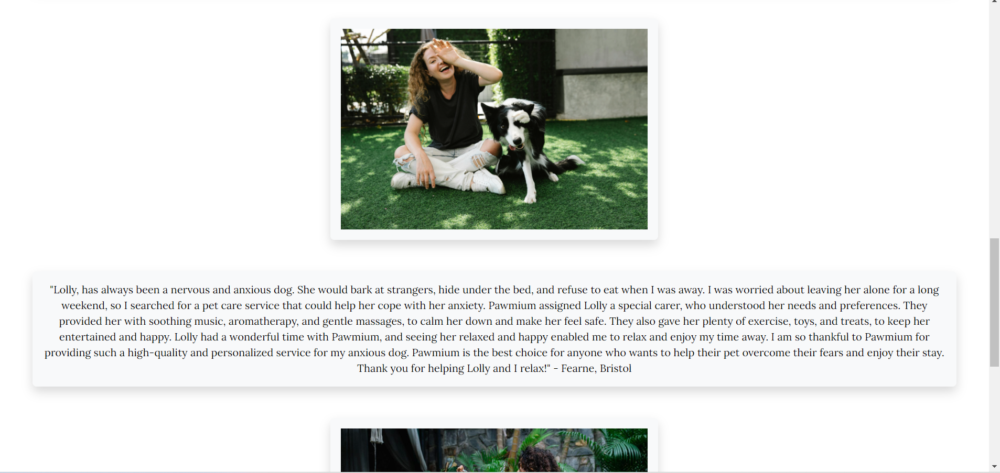
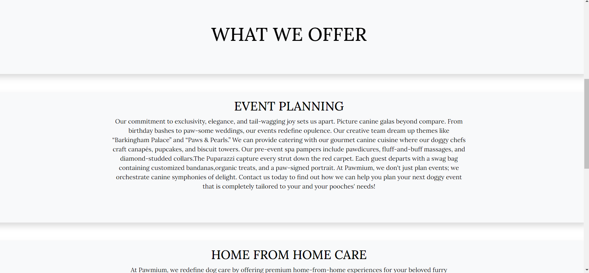
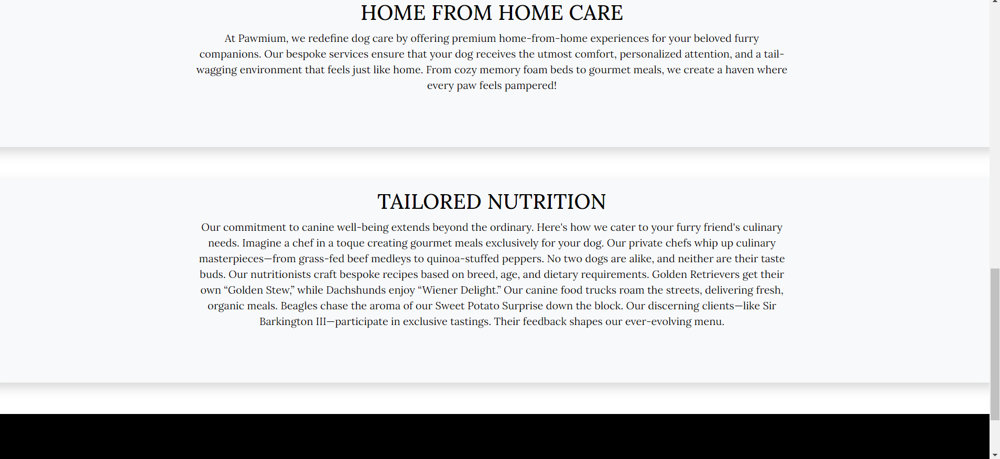

# PAWMIUM 

### URL of live site: https://bky93.github.io/Pawmium-Project-1/index.html

## About this site
Pawmium is a premium dog care service for those looking to ensure their dog has the best possible care, whether it be making sure their dog is looked after in luxurious whilst their owner is away or looking to plan a celebration for their four-legged friend. Pawmium offers a multitude of services with the added benefit that every service offered can be personalised to meet the individual needs of each dog and owner.
This website aims to guide the potential customer around the services Pawmium provides with the end result of being guided to the "get in touch" page to contact Pawmium with their enquiry so that Pawmium can get in contact with them to discuss it. The website was designed to ensure Pawmium is viewed as a premium service, this was also taken into account when the decision was made to not include pricing for standard, non-bespoke services. The website was also made to look professional and relatively minimalistic to ensure the end user fills in the contact form on the "get in touch" page. This website has also been made responsive for various screen sizes to ensure a consisent and positive user experience.

## CONTENTS
 - [User Experience](#target-audience)
	 - [User Stories](#user-stories)
 
 - [Design](#design)
	 - [Colour Scheme](#colour-scheme)
	 - [Typography](#typography)
	 - [Wireframes](#wireframes)
 - [Features](#features)
	 - [General features on each page](#features-by-page)
	 - [Future Implementations](#future-implementations)
	 - [Accessibility](#accessibility)
	
 - [Technology Used](#technologies-used)
	 - [Languages used](#languages-used)
	 - [Frameworks, Libraries, Programmes used](#libraries-and-programmes-used)
  
	 
 - [Deployment and Local Deployment](#deployment)
	 - [Deployment](#deployment)
	 - [Local Deployment](#deployment)
		 - [How to clone](#deployment)
		
- [Testing](#testing)
	 - [Manual testing](#manual-testing)
	 - [W3C testing](#manual-testing)
	 - [Lighthouse](#manual-testing)
	 - [Wave](#manual-testing)
 - [Bugs](#bugs)
 - [Credits](#credits)
 - [Acknowledgments](#acknowledgments)
 

## User Stories
As a static website the user goals will be the same for first time users and returning users. 

**Target Audience**
Pawmium is aimed at pet owners who want to go the extra mile for their dog. Pawmium's premium services are aimed towards animal lovers who have a strong bond with their dog and find it difficult to go away without knowing their dog is getting five star care. Pawmium also provides bespoke events for dog owners that want to have a special celebration for their pup or premium classes to give their pup more mental stimulation.

**User Goals**
* Pawmium aims for potential customers to immediately get a sense that Pawmium offers premium and customisable services. The content used on the website is clear and concise and aims to quickly put across to the user what Pawmium does. The design of the site aims to convey the luxuriousness of the services Pawmium offers by using a classic colour pallette, good quality images and a simple and elegant layout.

* Pawmium aims to get the potential customer to the "get in touch" page and to fill out the contact us form as soon as possible. The website has multiple call out buttons, one the homepage sends the user to the services page and one on the services page which leads the user to the "get in touch" page.

* The Pawmium website aims to be user friendly and visibly appealing on all devices. Media queries have been used to give the user good visbility of the site content on different devices.

## Design
## Colour Scheme
The colour scheme used is simple to provide a classic, elegant look and to allow the images on the site to pop more:

## Typography

I chose the Google Font 'Lora' because I believe it is both visibily appealing and also clear and concise. I believe this combination fits well with the elegant theme of the site.

## Wireframes
### Web view
#### Home

#### Services

#### Get In Touch

#### Thank you

### Mobile view
#### Home

#### Services

#### Get in touch

#### Thank you

## Features
### Nav Bar
	The nav bar used is from Bootstrap and is consistent in all pages. It is responsive and turns into a hamburger menu icon when being viewed on a smaller screen size. The page in the menu the user is hovering their mouse over will change font colour to reflect this. The font colour will also change to show which page the user is currently on. I opted to include the company name and a paw icon taken from font awesome https://fontawesome.com/icons which looked more visually appealing than including a custom logo.

#### Web/wider screen view:

#### Mobile/small tablet view:
##### Before clicking on the hamburger menu icon:

 

##### After clicking on the hamburger menu icon:

 

**Footer with Social Media Links**
The footer across the site contains social media links that open in a new tab when clicked on.

 

## Features by page
**Landing page**
 

 

The landing page has been designed to capture the user's attention on first view by using a large hero image and call out. The call out contains a button that leads the user to the services page. The purpose of using this call out is to guide users through the website clearly and quickly as once they reach the services page this is again repeated to send the user to the get in touch page.
All images used on the landing page have been taken from pexels (https://www.pexels.com/) and all icons used have been taken from font awesome (https://fontawesome.com/icons). I used bootstrap to provide the shadow effect seen on the homepage and opted to keep the main colours of the page very basic and use bright and appealing images to provide the colour variety of the page, I believe this makes the web page look tasteful.

**Services Page**
 

 

 

The services page has been designed in a minimalistic way to ensure the services on offer are clear and concise and the hero image and call out catch the user's eye on first glance, leading them to the contact us page.
The hero image has been taken from pexels (https://www.pexels.com/). I used bootstrap to provide the shadow effect seen on the page.

**Contact page**
The contact page has been designed to appear clean, clear and concise with the aim for the user to fill out the contact us form. Once the user clicks submit on the contact us form they will be re-directed to the thank you page. The page also contains a map containing a pin where Pawmium's head office is. The map was added by using an iFrame link from Google Maps.

 

 

 

**Thank you page**
The user reaches the thank you page once they click submit on the contact us form. The thank you page is very basic and has been specifically designed this way to persuade the user to browse the rest of the site.
 

## Future Implementations
In future versions of this site I would like to add animation so the sections of the pages slide into view as the user scrolls. I would also like to add a section on nutrition containing videos made by Pawmium.
## Accessibility
I have used alt attributes for all images on the website and aria labels. I have also used back up fonts and
## Technologies used
**GitPod**

Gitpod is the IDE used for editing my site and pushing changes.

**GitHub**

I used github for storage of the site

**Python**

Python was used when opening a port 8000 preview when coding in Gitpod.

**HTML5** 

HTML5 forms the foundation of the website’s structure.

**CSS** 

CSS was used to style the elements of the website.
 
**Google Maps** 

I incorporated a Google map of Pawmium head office into my Landing page by utilizing an iFrame link from Google Maps.

**Font Awesome** 

I used Font Awesome Icons on my website.

**Google Fonts**

The font used on the website is 'Lora' from Google fonts.

## Languages Used

HTML5, CSS

## Libraries and programmes used

GitHub backing up all aspects of the project. Bootstrap was used for across the site for responsiveness, style and layout.

## Deployment

The site was deployed on GitHub pages. 

## Local Deployment
#### How to Clone:

1.  Log into your account on GitHub
2.  Go to the repository of this project [Pawmium-Project-1](https://github.com/Bky93/Pawmium-Project-1)
3.  Click on the code button, and copy your preferred clone link.
4.  Open the terminal in your code editor and change the current working directory to the location you want to use for the cloned directory.
5.  Type 'git clone' into the terminal, paste the link you copied in step 3 and press enter.

## Testing

## Manual Testing

**CSS Validator**

The W3C CSS validation service found 1 error as seen in the image above. I removed this line of css and found the site was not effected.

I also removed the css line that was flagged up in the warnings and found this did not effect the site.

I then checked it again and the validator confirmed there was no longer any errors:

**W3C Validator**

The HTML validator produced the following warning:

I tried changing the section element to a div element but this messed up the formatting of the page and I did not have time to work out how to fix it therefore I left the element as it was orginally and this is something I will keep in mind for future versions.

**Lighthouse**

I used the lighthouse extension for Google Chrome which gave me feedback as to the performance and speed of the website. The site had lower performance scores than I would like and this is something I would like to improve in future versions.

**Wave Testing**

I used the wave extension to check for contrast and errors on each page, it did not find any:

**Device testing**

The website was tested on the following devices:

- iPhone 11.

- iPhone 10.

- Pixel 7

- iPad.

- iPad Air.

- 32' widescreen monitor. 

**Browsers**

* Google Chrome
* Edge
* Firefox

## Bugs

1. * ***Issue Found:*** 
        * Bullet points showing in footer not required
    * ***Solution Used:*** 
        * Once content has been centered and list items set to "display:inline" it resolved the bullet point issue.
		
1. * ***Issue Found:*** 
        * Cannot add spacing to left of name in navbar 
    * ***Solution Used:***    
        * Added class="mx-auto p-2" to nav element which also improved the spacing to the right of the condensed navbar when viewing the site on a smaller screen
		
1. * ***Issue Found:*** 
        * Hamburger icon for opening menu does not work on services and contact us page 
    * ***Solution Used***:
        * Script missing from services.html and contact.html - added to both and hamburger icon now opens when clicked.
		
1.    * ***Issue Found:*** 
        * Menu items not showing on dropdown on smaller devices.
		    * ***Solution Used***:
        * I commented out my navbar CSS to see if this was causing the issue and it seems it is. I then commented out each piece of CSS individually and realised it was the following causing an issue and removed it: .navbar-collapse {padding-left:600px;} I then re-added the padding as a percentage.
1.    * ***Issue Found:*** 
        * Hamburger icon for opening menu does not work on thank you page.
		    * ***Solution Used***:
        * Script missing from page, added and hamburger icon now opens when clicked.
1.    * ***Issue Found:*** 
        * Home menu item does not take use to homepage when clicked on from thanks.html
		    * ***Solution Used***:
        * removed aria-current="page"  data-bs-toggle="dropdown" from anchor element.	
		
## Credits

I used windows co-pilot for some help with content creation.

I used stack overflow daily basis for guidance and problem solving. https://stackoverflow.com/

I used free images from Pexels. https://pexels.com/

I used Bootstrap for certain elements and style

### Acknowledgments

I would like to acknowledge my mentor Luke for his help in checking this project and the motivation the mentoring sessions have given me.
I would also like to acknowlege everyone that posts on slack as it has been an incredibly helpful support along the way.

